<!-- @format -->

# Messagely

This is a React-based Single Page Application, with a Ruby-on-Rails backend. It allows users to create their own accounts, log in, receive messages from other users as well as being able to send, edit and delete their own.

It was designed partly to fulfil a set of passing criteria for the phase 4 project of Flatiron's Software Engineering Course.

## User Experience

Users can navigate the login via client side routes:

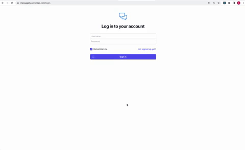

They can create an account with with sign up page:

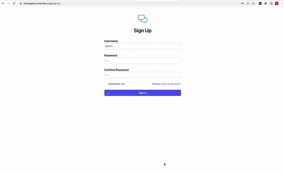

That they can use to login:

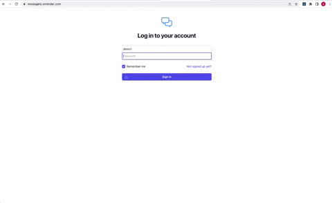

When the 'Remember Me' option is checked, their logged in status will persist:

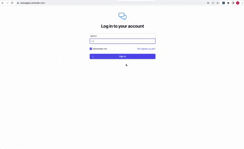

When it isn't, it won't:

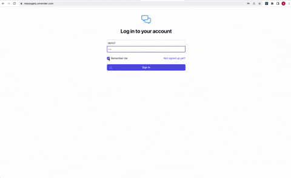

Users can start conversations with other users:

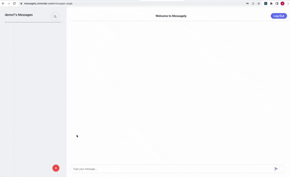

In which they can send messages:

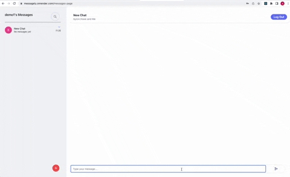

Conversation titles and messages' content can be edited:

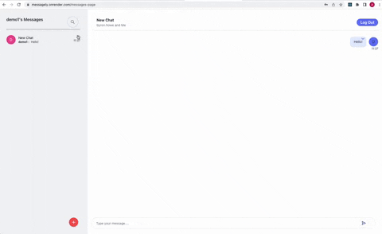

And each can be deleted:

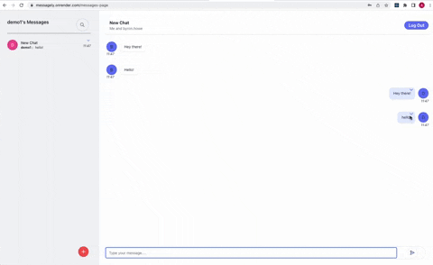

However, a user can only delete their own messages (conversations will be fully deleted when all users have deleted the conversation):

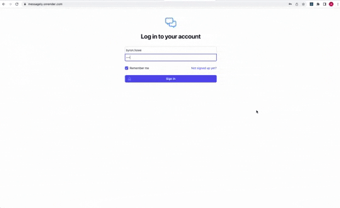

Conversations can also be filtered by their users' usernames:

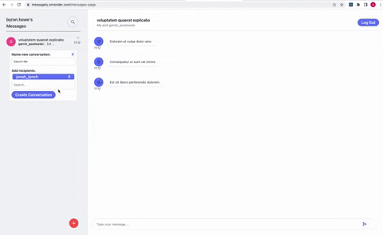

When validations fail, error messages will be displayed on the DOM:

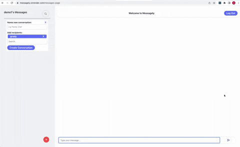

## Project Requirements for the Messagely Messaging App

1. _Use a Rails API with a React frontend_

   - This app's backend was generated with the rails --api flag

   - That backend responds to requests of the React frontend, submitted by the user via links and forms

2. _Have at least three models that include a many-to-many relationship and full CRUD actions for at least one resource._

   - This app has 3 resources: Users, Messages and Conversations

   - Users and Conversations have a many-to-many relationship through the Messages resource

   - Full CRUD actions are available on both messages and conversations

3. _Active Record Validations must be present on your models for most attributes_

   - There are validations for all user-submitted attributes for the Conversation, User and Message models

4. _Use controller validations to alter backend json responses to front end; pass error messages to the frontend and dispaly them if the action fails_

   - As displayed in the User Experience, failed validations display their errors to the DOM

5. _Properly update front end state upon successful response from a POST, PATCH, or DELETE request_

   - This app updates its front end via state, rather than successive GET requests

6. _Have at least 3 different client-side routes using React Router_

   - This app has 3 client-side routes: /login, /signup and /messages

7. _Implement authentication/authorisation, including password protection. Users must be able to sign up, log in (and stay logged in via user ID in the session hash) and log out_

   - This app implements both authentication and authorisation

   - Passwords are hashed and salted via BCrypt, via the has_secure_password macro

   - Users can stay logged in via the session hash

   - They also have the option of deselecting 'remember me' and _not_ staying logged in via the sesion hash

8. _Use the React hook useContext to persist your logged in user object in front end state and avoid props drilling_

   - This app uses context to store the fetched user Object

   - It also uses composition in the Messages Page to avoid prop-drilling

## NOTES

- This backend generates placeholder data for the App via use of the [Faker Gem](https://github.com/faker-ruby/faker)

- The buttons, login, sign up and delete confirmation modal were styled using Tailwind's [template components](https://tailwindui.com/components)

- The layout for this app is the [Messages UI Layout by iaminos](https://tailwindcomponents.com/component/messages-ui-layout)

- The dropdown filter function in Conversations' create action was adapted from w3's Search/Filter [Dropdown](https://www.w3schools.com/howto/howto_js_filter_dropdown.asp)

- The expandable search bar in the Messaging Sidebar is adapted from [Tailus' expandable search bar](https://play.tailwindcss.com/sbm4jEWJoA)
